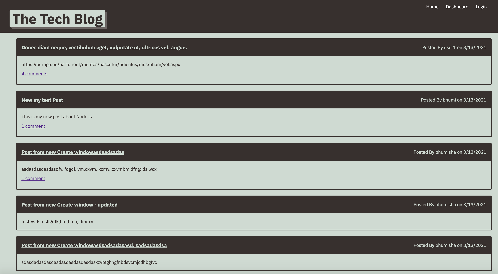
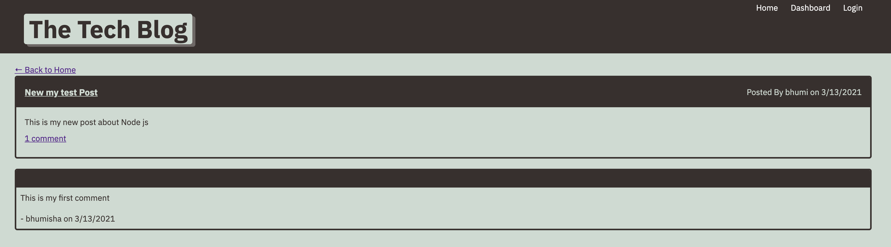
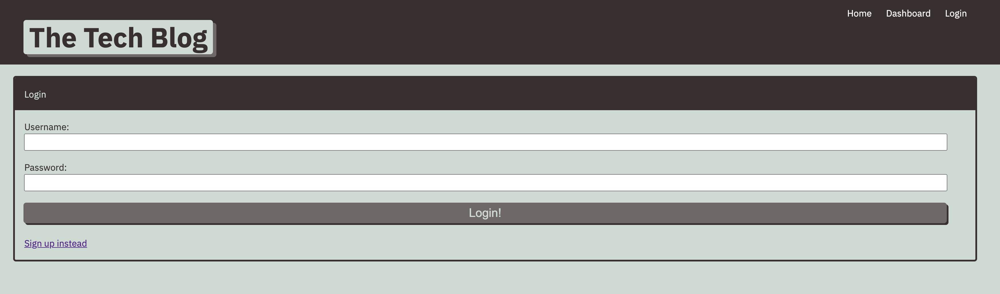
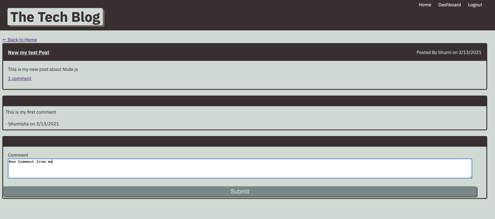
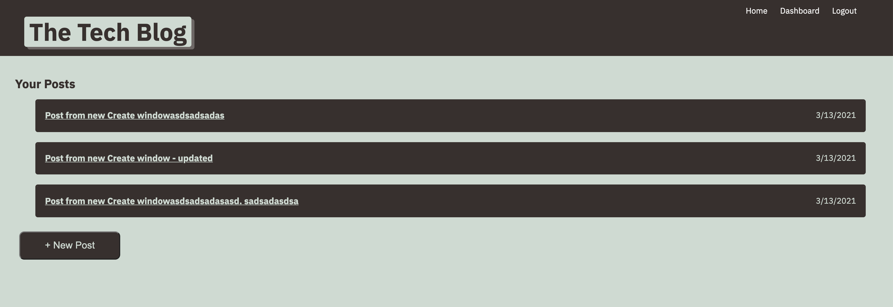
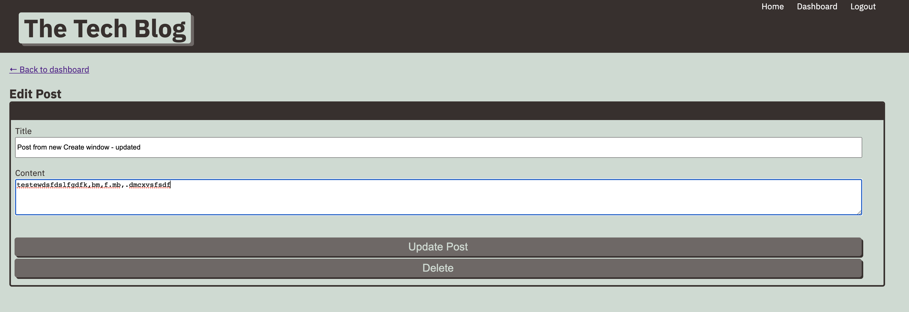

# Tech-Blog

## Description
    Tech-blog is CMS-style blog site where the user can create account and post their blog and also comments on other users blog.

    This application is folliowing the MVC paradigm in its architectural structure. it is using Handlebars.js as the templating language, Sequelize as the ORM , MYSQL as the database, and the express-session for authentication. dotenv is used to protect your credential. bcrypt library is used for encryption for password.

    If you have not added node than please install node and than npm install. 
    It will deploy all required node modules to project than run node server.js
    All code is written in ES6. 

## Installation
To install following dependencies run the following command: it will install, inquirer , mysql2, dotenv, Handlebars.js,express-session,express ,bcrypt and Sequelize libraries.

npm install

## Project Deployment / GitHub Detail

This project is deployed in Github. User can go thru files and clone the project. For clone the project use below options or you can download Zip file.

SSH - "git@github.com:bhumisha/Tech-Blog.git"

HTTPS - "https://github.com/bhumisha/Tech-Blog.git"

Project Source code :
https://github.com/bhumisha/Tech-Blog

Project is deployed on Heroku. Heroku is a cloud platform as a service where user can deploy project with many languages.

Heroku URL
https://cms-tech-blog.herokuapp.com/

## Images

Below image shows overview of Tech-Blog application.

Home page 

View Blog with comments -> Login is not yet done.

View Blog with comments -> Login is not yet done.

Login page

Add Comment to other users blog 

Dashboard page

Update or Delete users blog
